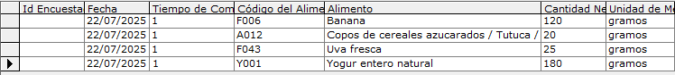

# Procesamiento de la información con el sistema SARA

SARA es un sistema utilizado para el análisis y registro de alimentos, provisto 
por el ministerio de salud. En este proyecto, la herramienta nos permite 
transformar las respuestas realizadas por los participantes de la encuesta sobre 
el consumo de alimentos en las últimas 24 hs en una composición detallada de su 
nutrición.

En este documento se detalla el paso a paso de la carga de personas, alimentos,
y la metodología utilizada para la construcción de la base de datos.

# Paso 1: Cargar a la persona en el sistema

Dentro del menú principal de SARA, presionamos el botón `Carga y cálculo de datos de ingesta`,
se muestra un formulario para completar información de la persona y cada una de sus comidas.

Tomando el registro del individuo con ID 8, cargamos su información:

> [!IMPORTANT]
> En la encuesta no se solicitó información del peso de la persona, pero el 
sistema lo requiere, entonces se procede a colocar el límite superior del intervalo
de edad indicado. De todas formas, no afecta en el aporte nutricional de los alimentos.

# Paso 2: Cargar comidas según la respuesta

En el apartado de la comida, se comlpeta la fecha y el tipo de comida a consumir. 

Y, por ejemplo, una respuesta como "Un yogur sin lactosa natural sin TACC de 180grs 
más dos cucharadas soperas de cereales más 1 banana y 5 uvas" se traduce en:

# Paso 3: Exportar alimentación del día

Una vez se cuenta con toda la alimentación de ese día de la persona, se presiona el
botón `Exportar todo` y almacenamos el archivo. 

Las celdas correspondientes a la composición nutricional de la comida, se copian y
pegan en una planilla donde indicamos a qué ID se refiere y alguna observación necesaria.

Estos pasos se hacen para todos los individuos, resultando en la base de datos nutricionales.